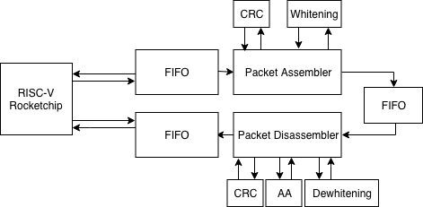
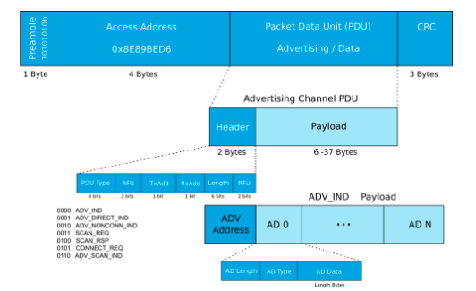
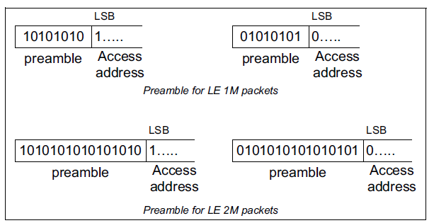
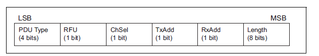
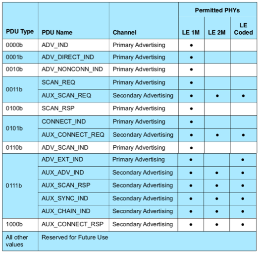
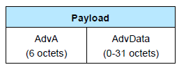

<<<<<<< HEAD
# EE290C Bluetooth Low Energy Baseband

[](https://travis-ci.org/ucberkeley-ee290c/fa18-ble)

This Documentation is for Bluetooth Low Energy (BLE) Baseband group work in EE290C @ UC Berkeley 2018 fall semester.

## Course Description
2018 Fall EE290C, taught by Prof. Borivoje Nikolic, offers Advanced Topics in Circuit Design: VLSI Signal Processing. The course adopts Chisel, an open-source hardware construction language developed at UC Berkeley, to implement digital signal processing designs. The design could be verified by hooked up to the Rocket Chip. Our group chose to implement a BLE baseband for the final project.
<br>

## Project Overview
The BLE baseband we implemented includes two main blocks: packet assmebler (PA) and disassmbler (PDA), which are responsible for TX and RX sides respectively. Two submodules, CRC and (de)whitening, are attached to PA/PDA to follow Bluetooth Specification v5.0. The final goal is to implement a complete BLE baseband loop chain. 

The diagram of the expected BLE loop chain is shown below:


<br>

## Team Members
Jerry Duan, Mingying Xie, and Yalun Zheng
<br><br>

## Tape-in 1
- Update PacketAssembler to new Chisel standard and connect to RocketChip
- Build PA Chain and insert FIFOs for testing
- Construct C tests to verify the functionality

## Tape-in 2
- Improve packet transmitting effeciency (delete CRC_seed and white_seed in the PA input bundle)
- Complete PA chain and the output matches software golden model
- Similar work as tape-in1 has been done to PacketDisAssembler (update PDA to Chisel standard)
- Complete PDA chain and the output matches software golden model

## Tape-out
- Verify the functionality of PA and PDA chain respectively by connecting to RocketChip and making comprehensive C tests
- Implement and verify the Loopback Chain
- Documentation
<br>


## Modules
1) PA: 
[packet assembler](https://github.com/ucberkeley-ee290c/fa18-ble/tree/master/doc/pa.md), 
[PA chain](https://github.com/ucberkeley-ee290c/fa18-ble/tree/master/doc/pa_chain.md)
2) PDA: 
[packet disassembler](https://github.com/ucberkeley-ee290c/fa18-ble/tree/master/doc/pda.md), 
[PDA chain](https://github.com/ucberkeley-ee290c/fa18-ble/tree/master/doc/pda_chain.md)
3) CRC: 
[CRC](https://github.com/ucberkeley-ee290c/fa18-ble/tree/master/doc/crc.md)
4) Whitening: 
[Whitening](https://github.com/ucberkeley-ee290c/fa18-ble/tree/master/doc/whitening.md)
5) Top level: 
[loopback](https://github.com/ucberkeley-ee290c/fa18-ble/tree/master/doc/loop.md)
<br>

## Working Principle
Below is an overall diagram of the BLE packet structure. As specified in Bluetooth Specification v5.0, the BLE packet includes Preamble, Access Address, PDU (header and payload), and CRC.



### Preamble
For LE 1M packet, the preamble is determined by the last bit of access address (AA). It should be noted here, since the AA sequence has to be flipped for transmitting, the bit we actually look at is the first bit in the AA field (if 0, preamble is 01010101; if 1, preamble is 10101010).



### Access Address
The standard AA for broadcasting is 0x8E89BED6. Thus the encoded AA is 0110_1011_0111_1101_1001_0001_0111_0001.
Matlab code demonstration: ``fliplr(dec2bin(hex2dec('8E89BED6'),32))``

### PDU: Header
The PDU header contains 6 parts: PDU type, RFU, RxAdd, TxAdd, ChSel and Length.

#### PDU type
Our project adopts `ADV_NONCONN_IND` in LE 1M packet implementaion.


#### RFU
Reserved for future use in Spec v.05.
#### RxAdd, TxAdd
0 means public address, 1 means randomized address. Set both to 0 in this project. 
#### Length
Indicate the size of payload in bytes/octets. The length should be larger than 6 (reserved for advertising address) and less than 37. For example, if we have 6 for address, 3 for headers, 6 for payload, then PDU_length is 15. Similar to AA, the transmition start with LSB, so length 15 is 11110000 to keep the correct order.


### PDU: Payload


There are three sections within the payload we used, which are advertising address and two advertising data (denoted as payload1 and payload2).
#### Advertising Address
Here defined the advertiser MAC address. In this project, AdvA is set to 0x90d7ebb19299. This should also follow LSB-first transmission order.
#### Advertising Data
The payload1 is 0x02 (length), 0x01 (“flags”), 0x05 (flag data). The payload2 is 0x05 (length), type 0x08 (“short name”), data 0x32 0x39 0x30 0x43(ASCII code for “290C”).

### CRC
For this part, please refer to [CRC](https://github.com/ucberkeley-ee290c/fa18-ble/tree/master/doc/crc.md) and [whitening](https://github.com/ucberkeley-ee290c/fa18-ble/tree/master/doc/whitening.md).


### Noted:
BLE Spec has an explanation about whether we have to reverse the bit sequence: "Multi-octet fields, with the exception of the Cyclic Redundancy Check (CRC) and the Message Integrity Check (MIC), shall be transmitted with the least significant octet first. Each octet within multi-octet fields, with the exception of the CRC (see Section 3.1.1), shall be transmitted in LSB first order. For example, the 48-bit addresses in the advertising channel PDUs shall be transmitted with the least significant octet first, followed by the remainder of the five octets in increasing order."


## TODO
- Add-on features like FEC mentioned in Bluetooth 5 Spec

- Besides advertising PDU type, implement scan type (eg.`SCAN_REQ`), connect (`CONNECT_REQ`) and so on

- Apply more random-generated test cases

- Take operation frequency into considerations when the digital BLE baseband has to talk with analog circuits
<br>

## Acknowledgement
Here is our appreciation to Prof. Borivoje Nikolic, Prof. Kristofer Pister and the GSI Paul Rigge for guiding us in this project. Their valuable suggestions and feedback help us move forward. Also the work from last semester's group inspired us greatly and here is their tape-out (https://github.com/tapeout/ble-baseband). Lastly, we would like to thank David Burnett and Rachel Zoll for helping us get on board and explain BLE packet structure and tests.
=======
Chisel Project Template
=======================

You've done the chisel [tutorials](https://github.com/ucb-bar/chisel-tutorial.git), and now you 
are ready to start your own chisel project.  The following procedure should get you started
with a clean running [Chisel3](https://github.com/ucb-bar/chisel3.git) project.

## Make your own Chisel3 project
### How to get started
The first thing you want to do is clone this repo into a directory of your own.  I'd recommend creating a chisel projects directory somewhere
```sh
mkdir ~/ChiselProjects
cd ~/ChiselProjects

git clone https://github.com/ucb-bar/chisel-template.git MyChiselProject
cd MyChiselProject
```
### Make your project into a fresh git repo
There may be more elegant way to do it, but the following works for me. **Note:** this project comes with a magnificent 339 line (at this writing) .gitignore file.
 You may want to edit that first in case we missed something, whack away at it, or start it from scratch.
 
#### Clear out the old git stuff 
```sh
rm -rf .git
git init
git add .gitignore *
```

#### Rename project in build.sbt file
Use your favorite text editor to change the first line of the **build.sbt** file
(it ships as ```name := "chisel-module-template"```) to correspond 
to your project.<br/>
Perhaps as ```name := "my-chisel-project"```

#### Clean up the README.md file
Again use you editor of choice to make the README specific to your project

#### Commit your changes
```
git commit -m 'Starting MyChiselProject'
```
Connecting this up to github or some other remote host is an exercise left to the reader.

### Did it work?
You should now have a project based on Chisel3 that can be run.<br/>
So go for it, at the command line in the project root.
```sh
sbt 'testOnly gcd.GCDTester -- -z Basic'
```
>This tells the test harness to only run the test in GCDTester that contains the word Basic
There are a number of other examples of ways to run tests in there, but we just want to see that
one works.

You should see a whole bunch of output that ends with something like the following lines
```
[info] [0.001] SEED 1506028591907
test GCD Success: 168 tests passed in 1107 cycles taking 0.203969 seconds
[info] [0.191] RAN 1102 CYCLES PASSED[info] GCDTester:
[info] GCD
[info] GCD
[info] Basic test using Driver.execute
[info] - should be an alternative way to run specification
[info] using --backend-name verilator
[info] running with --is-verbose creats a lot
[info] using --help
[info] ScalaTest
[info] Run completed in 1 second, 642 milliseconds.
[info] Total number of tests run: 1
[info] Suites: completed 1, aborted 0
[info] Tests: succeeded 1, failed 0, canceled 0, ignored 0, pending 0
[info] All tests passed.
[info] Passed: Total 1, Failed 0, Errors 0, Passed 1
[success] Total time: 2 s, completed Sep 21, 2017 9:12:47 PM
```
If you see the above then...
### It worked!
You are ready to go. We have a few recommended practices and things to do.
* Use packages and following conventions for [structure](http://www.scala-sbt.org/0.13/docs/Directories.html) and [naming](http://docs.scala-lang.org/style/naming-conventions.html)
* Package names should be clearly reflected in the testing hierarchy
* Build tests for all your work.
 * This template includes a dependency on the Chisel3 IOTesters, this is a reasonable starting point for most tests
 * You can remove this dependency in the build.sbt file if necessary
* Change the name of your project in the build.sbt
* Change your README.md

## Development/Bug Fixes
This is the release version of chisel-template. If you have bug fixes or
changes you would like to see incorporated in this repo, please checkout
the master branch and submit pull requests against it.
>>>>>>> ble-baseband/master

